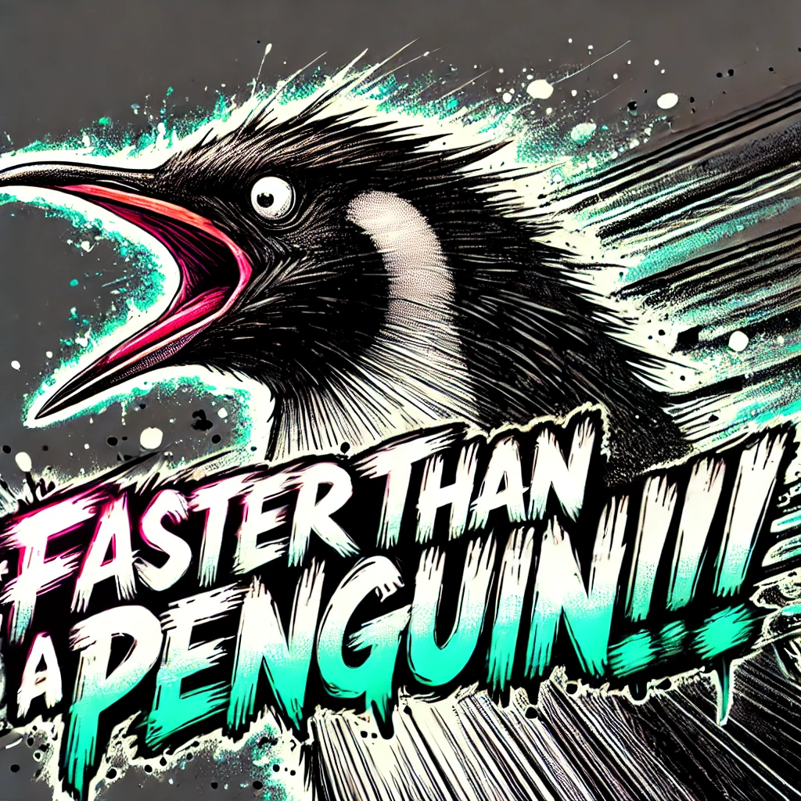
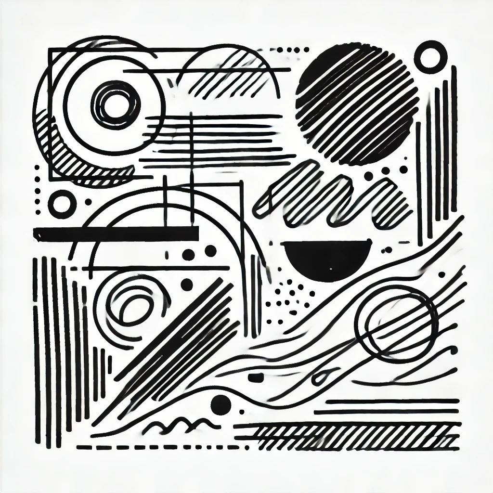

## 3d game lab3游戏博客

## 一、实验要求

完成一个简单的**非**井字棋 unity 小游戏或应用，有游戏视频

## 二、"Faster than a pinguin!!!"游戏介绍

本游戏是一个可以帮助玩家训练手速的游戏，游戏中的企鹅是一个基于强化学习被训练出来追踪小球的agent，每轮游戏中，如果玩家在企鹅接触小球前点击小球，玩家得分，否则企鹅得分，10轮(默认最低回合数)游戏结束后，如果玩家得分大于企鹅得分，玩家获胜；反之，企鹅获胜。如果分数相同，则比赛平局，每次游戏开始前玩家可以通过滑块调整企鹅的速度和游戏回合数，以提升游戏难度，增加游戏可玩性。

游戏开始、游戏中与游戏结算画面(以企鹅胜利为例)截图如下：


游戏示例视频已上传至pinata，下载链接(28MB)：https://brown-urban-hornet-311.mypinata.cloud/ipfs/QmbLGdTVARv1yPe5LSzsqog3UtXzay5YtretpwGeRdTVYP

## 二、制作过程

### 2.1 实验工具

Unity 2021.3.39 + ml-agents release 19(v0.28.0)

**Unity介绍：**

Unity是一款功能强大的跨平台游戏引擎，被广泛应用于游戏开发和交互设计，自2005年推出以来，Unity已成为全球最受欢迎的游戏开发平台之一，其主要特点有：

- **跨平台支持**：Unity支持Windows、macOS、iOS、Android、WebGL等多个平台；

- **可视化编辑器**：Unity提供了直观的编辑器界面，开发者可以通过拖拽组件、调整参数等方式进行开发；

- **强大的渲染能力**：Unity拥有强大的图形渲染引擎，支持高质量的3D和2D渲染，适用于各种类型的游戏和互动应用；

- **丰富的插件和工具**：Unity拥有庞大的资源库和插件市场，开发者可以方便地获取所需的工具和资源。

像星露谷物语、空洞骑士等知名游戏均是用unity游戏引擎开发的。

**ml-agents介绍：**

ml-agents（Unity Machine Learning Agents Toolkit）是Unity提供的机器学习开发工具包，用于将机器学习技术应用于游戏和模拟环境中，其主要特点和功能包括：

- **强化学习和模仿学习**：ml-agents支持多种机器学习算法，特别是强化学习和模仿学习；

- **可视化训练过程**：开发者可以通过Unity Editor实时观察和调试训练过程，直观看到智能代理的行为和学习进展。

- **灵活的环境配置**：ml-agents允许开发者自定义训练环境，设置奖励机制、观察空间和动作空间，以满足不同的训练需求。

- **TensorFlow和PyTorch支持**：ml-agents支持与TensorFlow和PyTorch等主流机器学习框架的集成；

GitHub仓库地址：https://github.com/Unity-Technologies/ml-agents

本游戏利用李ml-agents提供的强化学习支持，训练了一个可以追踪小球的agent作为游戏npc，下文会描述详细的训练过程。


### 2.2 实验关键步骤——企鹅agent训练过程

#### 2.2.1 ml-agents release 19配置

windows配置会更加方便，本人使用的是mac，中间还走了些弯路，配置过程已上传博客园，链接：https://www.cnblogs.com/acciosth/p/18319252

#### 2.2.3 创建训练环境

确定要训练的agent, goal和位于的环境，本游戏训练环境如下图所示，为一agent在一个四方有墙的环境，与goal小球有一定距离：


本游戏采用的企鹅模型来自于unity free resources之一：https://assetstore.unity.com/packages/3d/characters/animals/animals-free-260727

接下来要创建训练脚本，然后作为component被添加到此企鹅agent对象上。

#### 2.2.4 训练脚本

关键训练代码：

```c#
using System.Collections;
using System.Collections.Generic;
using UnityEngine;
//用到的ml-agents的包
using Unity.MLAgents;
using Unity.MLAgents.Actuators;
using Unity.MLAgents.Sensors;

public class MoveToGoalAgent : Agent //继承自agent而不是monobehavior
{
    [SerializeField] private Transform targetTransform;
    [SerializeField] private Material winMaterial; //训练时碰到小球，地板变绿表示上次成功，可视化训练进展
    [SerializeField] private Material loseMaterial; //训练时碰到墙壁重新开始，地板变红表示上次失败
    [SerializeField] private MeshRenderer floorMeshRenderer;

    public bool isGameActive = false;
    private float moveSpeed = 10f; // 默认速度

    public GameManager gameManager;

    // 每轮初始化或重置代理状态
    public override void OnEpisodeBegin()
    {
        if (!isGameActive)
        {
            // 重置至初始位置，保持静止
            transform.localPosition = new Vector3(0f, 0.994f, 0f);
            return;
        }

        // 生成企鹅agent的随机位置
        transform.localPosition = new Vector3(Random.Range(-13.71f, 1f), 0.994f, Random.Range(-9.03f, 10f));

        // 生成目标小球的随机位置，确保距离代理至少2米以防止重叠
        Vector3 targetPosition;
        float minDistance = 2f;
        do
        {
            targetPosition = new Vector3(Random.Range(-14.9f, +13.14f), 2f, Random.Range(-11.09f, 10.74f));
        } while (Vector3.Distance(transform.localPosition, targetPosition) < minDistance);

        targetTransform.localPosition = targetPosition;
    }

    // 收集环境信息
    public override void CollectObservations(VectorSensor sensor)
    {
        sensor.AddObservation(transform.localPosition);
        sensor.AddObservation(targetTransform.localPosition);
    }

    // 手动控制代理，用于测试
    public override void Heuristic(in ActionBuffers actionsOut)
    {
        if (!isGameActive)
            return;

        ActionSegment<float> continuousActions = actionsOut.ContinuousActions;
        continuousActions[0] = Input.GetAxisRaw("Horizontal");
        continuousActions[1] = Input.GetAxisRaw("Vertical");
    }

    // 接收并执行动作
    public override void OnActionReceived(ActionBuffers actions)
    {
        if (!isGameActive)
            return;

        float moveX = actions.ContinuousActions[0];
        float moveZ = actions.ContinuousActions[1];

        // 旋转效果实现
        float turnSpeed = 300f;
        Vector3 moveDirection = new Vector3(moveX, 0, moveZ).normalized;
        if (moveDirection != Vector3.zero)
        {
            Quaternion toRotation = Quaternion.LookRotation(moveDirection, Vector3.up);
            transform.rotation = Quaternion.RotateTowards(transform.rotation, toRotation, turnSpeed * Time.deltaTime);
        }

        // 代理采取下一步动作
        transform.localPosition += moveDirection * Time.deltaTime * moveSpeed;
    }

    // 代理碰到小球，正奖励，代理碰到墙壁，负奖励
    private void OnTriggerEnter(Collider other)
    {
        if (other.TryGetComponent<Goal>(out Goal goal))
        {
            SetReward(+1f);
            gameManager.AgentTouch();
            EndEpisode();
        }
        if (other.TryGetComponent<Wall>(out Wall wall))
        {
            SetReward(-1f);
            EndEpisode();
        }
    }

    // 停止
    public void StopAgent()
    {
        isGameActive = false;
        EndEpisode();
    }

    // 设置代理速度
    public void SetSpeed(float speed)
    {
        moveSpeed = speed;
    }
}
```

#### 2.2.5 训练过程截图

附加好脚本，并添加上来自于ml-agents package的decision requester(默认的强化学习里做决策的模块封装)组件，调好参数：


在命令行启动ml-agents，并为提升训练效率增多训练场景并行训练：


训练完后，会在训练目录生成results文件夹，里面有训练好的模型，格式为.onnx，将训练好的模型拖入agent组件对应位置并设置仅靠推理进行动作，就可以将agent应用与游戏了：


另外在实验中也可以通过tensorboard看到可视化的训练过程：

**如每轮训练时长变化：**


#### 2.3 其余实验步骤介绍

除了训练agent，剩余的工作主要有：

##### **搭建游戏场景，设计背景和贴图：**

背景的贴图来自于gpt-4o加以调色，原图为：





此外开始、游戏中和结束场景是采用unity中的canvas加上各种ui控件实现，层级关系如下：


##### **实现游戏机制：**

主要通过增加一个GameManager游戏对象编写脚本实现对各个游戏对象的控制来实现游戏机制。

关键代码：

```c#
//省略using的模块

public class GameManager : MonoBehaviour
{
    //agent
    public MoveToGoalAgent agent;
		//开始和结束面板
    public GameObject startPanel;
    public GameObject endPanel;
		//速度和回合数调节slider
    public Slider speedSlider;
    public Slider roundSlider;
  	//各显示文本
  	public TextMeshProUGUI resultText; 
    public TextMeshProUGUI speedText;
    public TextMeshProUGUI roundText;
    public TextMeshProUGUI scoreText; 
    public TextMeshProUGUI roundInfoText; 
    public TextMeshProUGUI speedShowTxt; 
		//游戏数值定义与初始化
    public int playerClicks = 0;
    public int penguinScore = 0;
    public int totalRounds = 10;
    public int currentRound = 0;

    void Start()
    {
        // 初始化并显示开始面板
        ShowStartPanel();

        // 设置Slider初始值并更新显示
        speedSlider.value = 10;
        roundSlider.value = 10;
        OnSpeedSliderChanged(speedSlider.value);
        OnRoundSliderChanged(roundSlider.value);

        // 初始化比分和回合信息
        UpdateScoreText();
        UpdateRoundInfoText();
    }

    private void Update()
    {
        // 每帧更新比分和回合信息
        UpdateScoreText();
        UpdateRoundInfoText();
    }

    public void PlayerClick()
    {
        // 玩家点击，增加点击次数和当前回合，结束当前回合并检查游戏状态
        playerClicks++;
        currentRound++;
        agent.EndEpisode();
        CheckGameStatus();
    }

    public void AgentTouch()
    {
        // 企鹅到达目标，增加企鹅得分和当前回合，结束当前回合并检查游戏状态
        penguinScore++;
        currentRound++;
        agent.EndEpisode();
        CheckGameStatus();
    }

    public void CheckGameStatus()
    {
        // 检查当前回合是否达到总回合数，若是则结束游戏
        if (currentRound >= totalRounds)
        {
            EndGame(playerClicks, penguinScore);
        }
    }

    void EndGame(int playerClicks, int penguinScore)
    {
        // 根据得分判断胜负，并显示结果和结束面板
        if (playerClicks > penguinScore)
        {
            resultText.text = "You Win!";
        }
        else if (playerClicks < penguinScore)
        {
            resultText.text = "Penguin Wins!";
        }
        else
        {
            resultText.text = "Draw!";
        }
        agent.StopAgent();
        ShowEndPanel();
    }

    public void StartGame()
    {
        // 开始游戏，隐藏开始面板和滑块
        resultText.text = "";
        startPanel.SetActive(false);
        HideSliders();
        agent.isGameActive = true;
        agent.OnEpisodeBegin(); // 开始新的Episode
    }

    public void RestartGame()
    {
        // 若选择重启游戏，重置计数并开始新的Episode
        endPanel.SetActive(false);
        HideSliders();
        agent.isGameActive = true;
        playerClicks = 0;
        penguinScore = 0;
        currentRound = 0;
        resultText.text = "";
        agent.OnEpisodeBegin(); 
    }

    public void QuitGame()
    {
        // 退出游戏
        Application.Quit();
    }

    void ShowStartPanel()
    {
        // 显示开始面板和滑块
        ShowSliders();
        startPanel.SetActive(true);
        endPanel.SetActive(false);
    }

    void ShowEndPanel()
    {
        // 显示结束面板和滑块
        ShowSliders();
        endPanel.SetActive(true);
    }

    public void OnSpeedSliderChanged(float value)
    {
        // 当速度滑块值变化时，更新速度并重置计数
        playerClicks = 0;
        penguinScore = 0;
        currentRound = 0;
        int intValue = Mathf.RoundToInt(value / 5) * 5;
        speedSlider.value = intValue;
        speedText.text = "Penguin's Speed: " + intValue;
        speedShowTxt.text = speedText.text;
        agent.SetSpeed(intValue);
    }

    public void OnRoundSliderChanged(float value)
    {
        // 当回合滑块值变化时，更新总回合数并重置计数
        playerClicks = 0;
        penguinScore = 0;
        currentRound = 0;
        int intValue = Mathf.RoundToInt(value / 5) * 5;
        roundSlider.value = intValue;
        roundText.text = "Rounds: " + intValue;
        totalRounds = intValue;
    }

    private void ShowSliders()
    {
        // 显示滑块和对应的文本
        speedSlider.gameObject.SetActive(true);
        roundSlider.gameObject.SetActive(true);
        speedText.gameObject.SetActive(true);
        roundText.gameObject.SetActive(true);
    }

    private void HideSliders()
    {
        // 隐藏滑块和对应的文本
        speedSlider.gameObject.SetActive(false);
        roundSlider.gameObject.SetActive(false);
        speedText.gameObject.SetActive(false);
        roundText.gameObject.SetActive(false);
    }

    private void UpdateScoreText()
    {
        // 更新比分显示
        scoreText.text = "You: " + playerClicks + " vs Penguin: " + penguinScore;
    }

    private void UpdateRoundInfoText()
    {
        // 更新回合信息显示
        roundInfoText.text = "Round: " + currentRound + "/" + totalRounds;
    }
}
```

## 三、实验总结

本次实验的初衷是想在unity中实践本学期可用于构建游戏npc的机器学习算法，调研后发现了ml-agents, sentis此类unity提供的工具包，于是构思了这样一个练手速的小游戏，**目前ml-agents已经转向sentis，对跨平台有了更好的支持**，值得未来进一步关注与学习。
